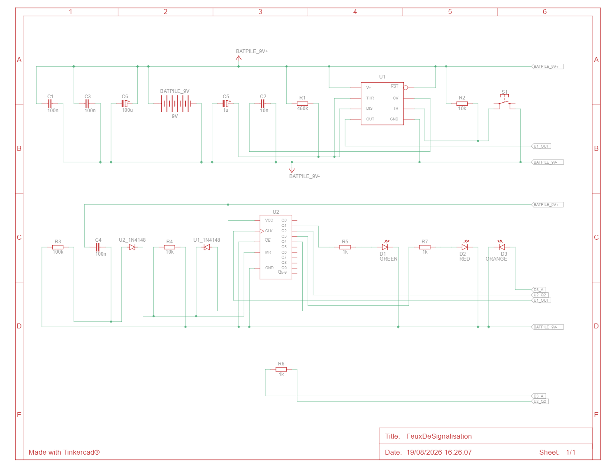
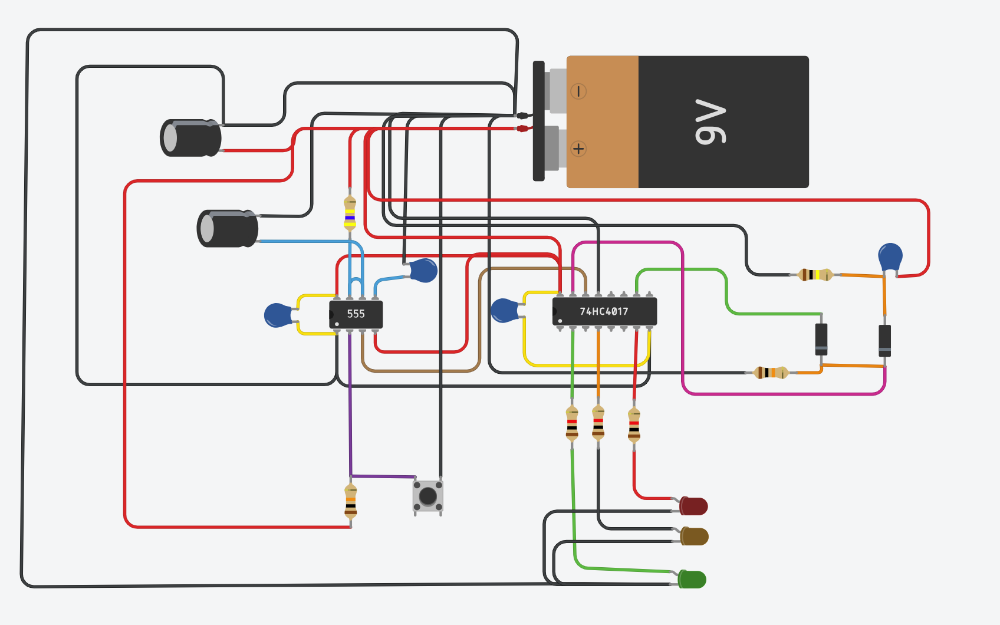

# Système de Feu Tricolore Électronique

Projet mécatronique complet intégrant la conception d'un circuit logique câblé (sans microcontrôleur), la modélisation 3D sous Fusion 360 et la fabrication d'un PCB par gravure à l'anglaise sur CNC 3018.

---

## 💡 Architecture & Principe de Fonctionnement

Le circuit repose sur une machine à états matérielle à séquence unique contrôlée par un bouton-poussoir unique :  
**ÉTEINT $\rightarrow$ VERT $\rightarrow$ ORANGE $\rightarrow$ ROUGE $\rightarrow$ ÉTEINT**

```text
                  ┌─────────────────┐
                  │ Bouton-poussoir │
                  └────────┬────────┘
                           │
                           ▼
                  ┌─────────────────┐
                  │   Anti-rebond   │
                  │   (NE555 / RC)  │
                  └────────┬────────┘
                           │ Impulsion propre (~500 ms)
                           ▼
                  ┌─────────────────┐
                  │    Séquenceur   │
                  │    (CD4017)     │
                  └───┬────┬────┬───┘
                      │    │    │
                     VERT ORG ROUGE

```

---

1. Conditionnement du Signal & Réglage du Temporisateur (NE555)  
Pour éviter qu'un appui mécanique ne génère des sauts d'états intempestifs (rebonds métalliques), le NE555 est monté en monostable.  
Il agit comme un masque temporel : dès le déclenchement, la sortie passe à l'état haut et ignore toute action sur le bouton pendant une durée $T$.  
La durée de verrouillage est régie par la formule :$$T = 1{,}1 \times R_1 \times C_5$$  
- Choix des valeurs : $R_1 = 460\text{ k}\Omega$ et $C_5 = 1\text{ }\mu\text{F}$.  
- Calcul du délai : $T = 1{,}1 \times 460\,000 \times 10^{-6} \approx 0{,}506\text{ s}$ (soit ~500 ms).  
- Justification : Un appui manuel standard durant entre 150 ms et 250 ms, ce délai de 0,5 s garantit un filtrage parfait des micro-rebonds au relâchement tout en offrant un ressenti d'appui net et délibéré.

2. Séquenceur & Initialisation (CD4017)  
- Comptage : Le compteur à décades CD4017 avance d'un pas à chaque impulsion reçue sur sa broche CLK (Pin 14).  
- Reset Cyclique : La sortie $Q_4$ (Pin 10) est reliée à l'entrée RESET (Pin 15) via une porte logique OU à diodes.  
Dès que le 4ᵉ appui active $Q_4$, le composant se réinitialise instantanément à $Q_0$ (état tout éteint).  
- Power-On Reset (POR) : Un réseau RC ($100\text{ nF}$ / $100\text{ k}\Omega$) injecte une impulsion sur la broche RESET lors de la mise sous tension pour garantir que le feu démarre systématiquement à l'état Éteint.
---

## 🛠️ Étapes de Conception Détaillées  
### Phase 1 : Prototypage sur Breadboard  
1. Montage et validation du bloc anti-rebond NE555 seul (vérification de l'impulsion unique à la LED de test).  
2. Intégration du CD4017 et câblage de la porte OU à diodes (1N4148) pour combiner le Power-On Reset et le reset cyclique $Q_4$.  
3. Ajustement de la résistance $R_1$ à $460\text{ k}\Omega$ pour éliminer le saut intempestif de couleurs.  
### Phase 2 : Schématique & Simulation  
1. Saisie du schéma théorique sous Tinkercad Electronics pour documentation.  
2. Transfert de la logique vers Fusion 360 Electronics (ou KiCad) pour préparation du typon.  
### Phase 3 : Modélisation 3D du Boîtier (Fusion 360)  
1. Corps principal (~165 mm de haut) : Conception verticale type feu tricolore de bureau.  
2. Isolation optique : Ajout de cloisons internes opaques entre chaque étage pour éviter les fuites de lumière d'une LED vers l'autre.  
3. Façade & Visières : Intégration de casquettes au-dessus des lentilles pour accentuer le contraste visuel.
4. Socle & Ergonomie : Base élargie accueillant l'embase de la pile 9 V, le PCB fixé par entretoises M3, et un bouton-poussoir large intégré en façade.  
### Phase 4 : Routage du PCB pour Gravure CNC  
1. Routage en simple face (Bottom Layer) pour faciliter l'usinage.   
2. Isolation & Pistes : Pistes élargies à 0,8–1,0 mm avec une isolation minimale de 0,4 mm pour garantir une découpe propre au V-bit.  
3. Pastilles (Pads) : Agrandissement des pastilles pour améliorer la tenue mécanique lors du perçage et du soudage des composants traversants.  
### Phase 5 : Usinage CNC (3018) & Assemblage  
1. Exportation des fichiers Gerber (.gbr) et de perçage Excellon (.drl).  
2. Calcul des parcours d'outils d'isolation sous FlatCAM.  
3. Envoi du G-Code via Candle avec exécution d'un Autoleveling / Heightmap (palpage Z) pour compenser la planarité du brut en cuivre.  
4. Perçage, détourage, soudure des composants traversants et montage final dans le boîtier imprimé en PETG/PLA sur Bambu Lab P1S.


## 💡 Schémas du Circuit

### Schéma Électrique Formel


### Schéma de Câblage


### Schéma PCB  
TODO  

---

## 🛠️ Matériel Requis (BOM)

|Nom	|Quantité	|Composant|
| :--- | :---: | :--- |
|BATPile 9V	|1	|Pile 9 V|
|C6	|1	|100 uF, 16 V Condensateur polarisé|
|U1	|1	|Minuterie|
|U2	|1	|Compteur à décades de Johnson|
|C3 , C1, C4|	3|	100 nF Condensateur|
|R1	|1|	460 kΩ Résistance|
|C2	|1	|10 nF Condensateur|
|C5	|1|	1 uF, 16 V Condensateur polarisé|
|S1	|1|	Bouton-poussoir|
|R2, R4	|2|	10 kΩ Résistance|
|R3	|1	|100 kΩ Résistance|
|U2_1N4148, U1_1N4148|	2	|5.1 V Diode Zener|
|R5, R6, R7	|3	|1 kΩ Résistance|
|D1	|1|	Vert LED|
|D2	|1|	Rouge LED|
|D3	|1|	Orange LED|

---
---

## 📐 Modélisation Boîtier

TODO 

---

## 🚀 Licence & Utilisation
Projet open-source réalisé à des fins personnelles et éducatives. Librement réutilisable et modifiable.